<html lang="ja">
    <head>
        <meta charset="utf-8" />
    </head>
    <body>
<h1>
PLY Editor
</h1>
<h2>なにものか？</h2>

　簡単な形状のPLY(プリミティブ)作成と、それを回転・スケーリング・平行移動するだけのエディターです。

<h3>環境構築</h3>

　pip install Open3D

<h3>プリミティブ作成</h3>

　<strong>リングの作成</strong> 
　　python src\createRing.py (分割数) (サイズ) (幅) (表面色) (裏面色) 
 
　(例１) 
　　python src\createRing.py  100  1  0.01  0  0  255  200  200  255 
 
　　　y-z 平面上にリング(100角形)を作成。サイズ(半径)は 1, 幅は 0.01。 
　　　表面は濃い青(0 0 255), 裏面は薄い青(200 200 255)。 
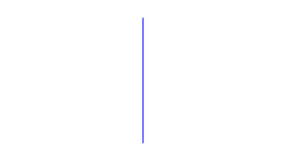
 
　(例２) 
　　python src\createRing.py 5  1  0.01  0  0  255  200  200  255 
 
　　　y-z 平面上にリング(5角形)を作成。サイズ(半径)は 1, 幅は 0.01。 
　　　表面は濃い青(0 0 255), 裏面は薄い青(200 200 255)。 
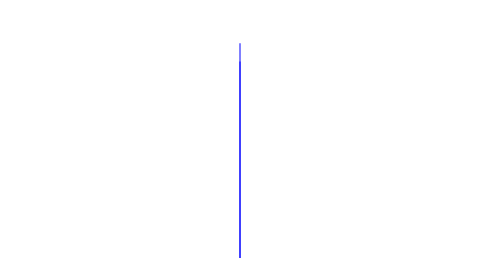
 
　<strong>白黒リングの作成</strong> 
　　python src\createRingBW.py (分割数) (サイズ) (幅) 
 
　(例１) 
　　python src\createRingBW.py  100  1  0.01 
 
　　　y-z 平面上にリング(100角形)を作成。サイズ(半径)は 1, 幅は 0.01。 
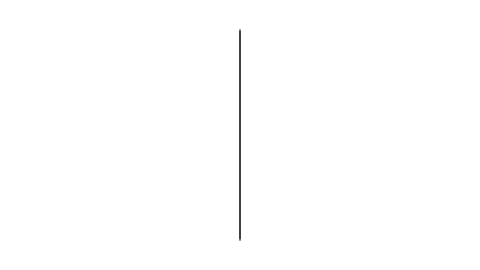

<h3>PLY編集</h3>

<strong>　回転・スケーリング・平行移動</strong> 
 
　プリミティブ PLY を回転・スケーリング・平行移動して PLYを作成する。 
　python src\PLY_RST.py (プリミティブPLY) (手順) 
 
　(例１) 
　　python src\PLY_RST.py data\ring_100.ply data\手順_りんご.txt 
 
　　(手順_りんご.txt) 
　　　s 1 1 0.5    # z 方向に 0.5倍 (scaling) 
　　　t 0 0 0.6    # z 方向に 0.6移動 (translation) 
　　　rr 18 y 10   # y軸に周りに10°回転 (rotation) を 18回 
　　　apple.ply    # apple.plyとしてセーブ 
 
　　　※ 手順ファイルの # 以降は無視されます。 
 
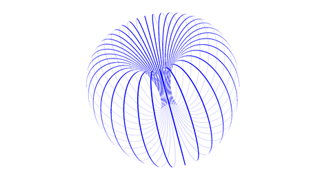
 
　(例２) 
　　python src\PLY_RST.py data\ring_100.ply data\手順_砂時計.txt 
 
　　(手順_砂時計.txt) 
　　　s 1 1 0.3　　  # z方向に0.3倍 
　　　r z 45　　　　 # z軸周りに45°回転 
　　　rr 36 x 10　　 # x軸周りに10°回転を36回 
　　　hourglass.ply　# hourglass.ply としてセーブ 
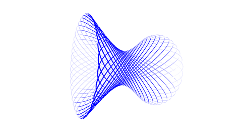
 
　(例３) 
　　python src\PLY_RST.py data\ring_100.ply data\手順_螺旋.txt 
 
　　(手順_螺旋.txt) 
　　　g 10 t 0 -1.5 0 r x 36 t 0.5 1.5 0　# (移動→回転→移動)をグループとして10回実行 
　　　spiral.ply　　　　　　　　　　# spiral.ply としてセーブ 
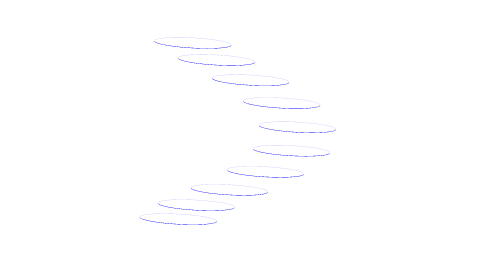
 
<strong>　回転・スケーリング・平行移動＋マージ</strong> 
 
　　回転・スケーリング・平行移動で複数の PLY を作成し、 
　　① python src\PLY_RST.py (プリミティブPLY) (手順) 
 
　　１つのPLYにマージする。 
　　② python src\merge_mesh_plys.py (PLYファイルへのワイルドカード(例：*.PLY)) 
　　　　または 
　　②'python src\merge_mesh_plys.py (PLYファイル1) (PLYファイル2) ･･･ 
 
　　(例１) 
　　　① python src\PLY_RST.py data\ring_100.ply data\手順_二枚貝.txt 
 
　　　(手順_二枚貝.txt) 
　　　　s 1 0.5 0.5 
　　　　r z -18 
　　　　t -np.sin(np.deg2rad(18))*0.5 0 0 
　　　　01.ply 
 
　　　　s 1 0.5 0.5 
　　　　r z 18 
　　　　t np.sin(np.deg2rad(18))*0.5 0 0 
　　　　02.ply 
 
　　　※数値の部分に np(numpy) を使った式を使うことができます。 
　　　　ただし, スペースを含めることはできません。 
 
　　　② python src\merge_mesh_plys.py *.ply 
 
　　　※ マージされた PLY が merged.ply に出力されます。 
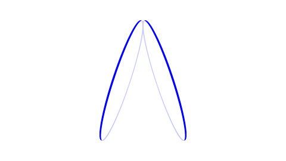
 
<strong>　手動で複数の PLY の位置関係を調整</strong>
 
　　python PLY_manual_edit.py (PLYファイル1) (PLYファイル2) 
 
　　1/2/3/4/5/6キーで PLY2 を回転、平行移動する。 
　　Shiftキーで逆方向に回転, 平行移動。 
　　7/8キー、Shift+7/Shift+8キーで回転量、平行移動量を増減。 
　　Ctrlキーで回転量, 平行移動量を大きくする。 
　　ESCキーを押下するとプログラム終了。マージされた結果が merged.ply に出力される。 
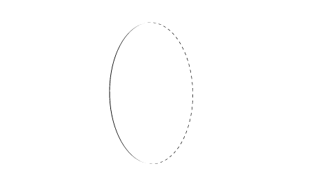 
 
<strong>　回転・スケーリング・平行移動 [インタラクティブ版]</strong> 
 
　　使い勝手が悪すぎたので, インタラクティブ版を作ってみた 
 
　　[0] 起動：python src\PLY_interactive.py 
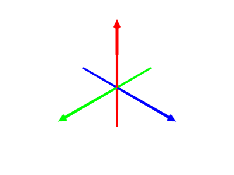 
　　コンソール画面からコマンドを入力する。 
　　[1] PLYファイルロード：　load data\ring_100.ply 
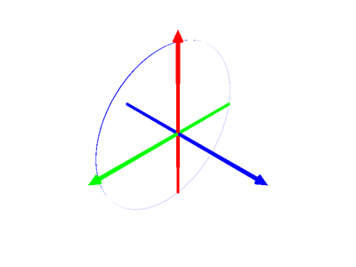 
　　[2] 回転コマンド：r 0 10 0 18 
　　　　y軸周りに10°回転を18回繰り返す。 
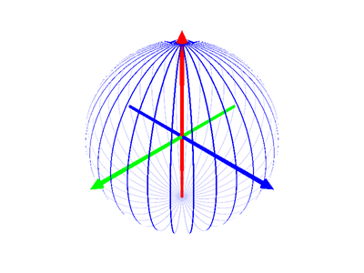 
　　[3] 座標軸を消す：axis 
　　　　axisを入力するたびに, 座標軸を消す→表示するをトグルする。 
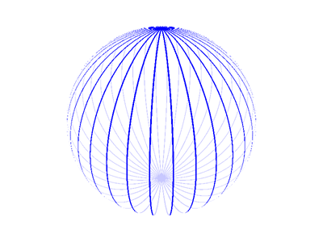 
　　[4] PLYをセーブする：save ball.ply 
 
　　[5] メッシュを削除する：del 
 
　　[6] PLYファイルロード：　load data\ring_100.ply 
 
　　[7] 回転/スケーリング/平行移動コマンド：g s 1 0.9 0.9 t 0 -0.5 0 r 20 0 0 t 0.1 0.5 0 30 
　　　　　グループコマンド 
　　　　　　① y-z平面で0.9倍にスケーリング 
　　　　　　② y方向に-0.5平行移動 
　　　　　　③ x軸周りに20°回転 
　　　　　　④ y方向に+0.5 x方向に+0.1 
　　　　　①～④を30回繰り返す。 
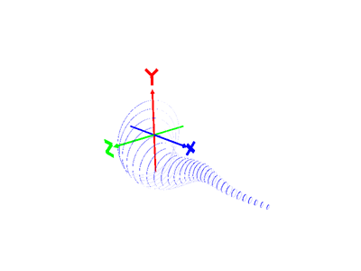 
　　[8] Undo：u 
 
　　[9] 終了：quit 
　　　　　Open3D の Visualizer画面を選んでESCキー押下でも終了する。

<h3>PLY表示</h3>

　python src\o3d_display_mesh.py (PLY) [-normal] 
 
　　-normal/指定せず： 　　　　　　 法線を計算する/しない 
　　マウスドラッグ: 　　　　　　　　モデルを回転する 
　　ホィールボタン押下＋ドラッグ：　モデルを移動する 
　　ホィールを回す：　　　　　　　　モデルの拡大、縮小 
　　＠キー/[キー押下：　　　　　　　画角変更 
　　pキー押下：　　　　　　　　　　 スクリーンキャプチャー 
　　1キー/Shift+1キー押下：　　　　 モデルの回転(x軸周り) 
　　2キー/Shift+1キー押下：　　　　 モデルの回転(y軸周り) 
　　3キー/Shift+1キー押下：　　　　 モデルの回転(z軸周り) 
　　4キー/Shift+1キー押下：　　　　 モデルの移動(x軸方向) 
　　5キー/Shift+1キー押下：　　　　 モデルの移動(y軸方向) 
　　6キー/Shift+1キー押下：　　　　 モデルの移動(z軸方向) 
　　7キー/Shift+7キー押下：　　　　 回転量を下げる/上げる 
　　8キー/Shift+8キー押下：　　　　 移動量を下げる/上げる 
    Ctrlキー＋1/2/3/4/5/6キー：　　 回転量, 移動量を大きくする 
　　↑キー/↓キー押下:　　　　　　　モデルのスケーリング 
　　ESCキー押下：　　　　　　　　　プログラム終了 
 
　python src\o3d_display_mesh_animate.py (PLY) [-normal] 
 
　　回転しつづける 
　　1～9キー,↑キー, ↓キーは効かない。

<h3>PLY interactive つづき</h3>

　デバッグできていないのに、機能追加･･･ 
 
　<strong>多角形メッシュ生成</strong> 
　　polygon (辺の数) [(サイズ) (高さ)] 
　　POLYGON (辺の数) [(サイズ) (高さ)] 
 
　(例) polygon 5 
　　　 サイズ(外接円の半径)のデフォルトは 1 
　　　 高さを指定しないと 0 (平板) 
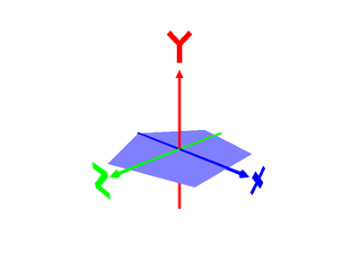 
　(例) polygon 5 1 0.2 
　　　高さを指定すると柱になる(厚みがでる) 
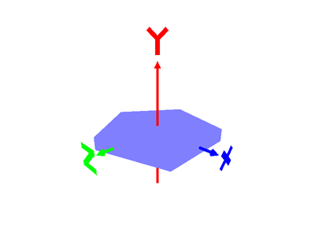 
　　　Open3D の Visualizer画面をクリックして wキーを押下するとワイヤーフレームを表示してくれる。 
　　　(座標軸や文字もワイヤーフレーム表示になってしまうが･･･) 
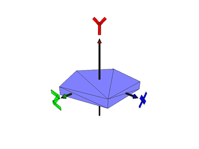 
　　(例) select 
　　　　　select from  ['', 'polygon5_side', 'polygon5_top', 'polygon5_bottom'] 
 
　　　　小文字版のコマンド(polygon)の場合、天板、底面、側面が別々のメッシュになっている。 
　　　　個別に操作できるが、メッシュ選択やマージ機能がちゃんとできていないので不便。 
　　　　削除する場合も d コマンドを3回実行する必要あり。 
 
　　(例) select polygon5_side 
　　　　 r 30 0 0 
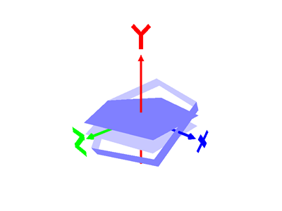 

　　大文字版のコマンド(POLYGON)だと全体が1個のメッシュになる。 
　　(例) POLYGON 5 1 0.2 
　　　　 r 30 0 0 
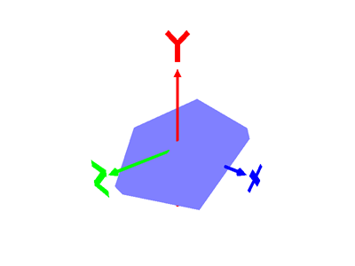 　

　　高さにマイナスを指定すると側面だけになる。 
　　(例) polygon 5 1 -0.2 
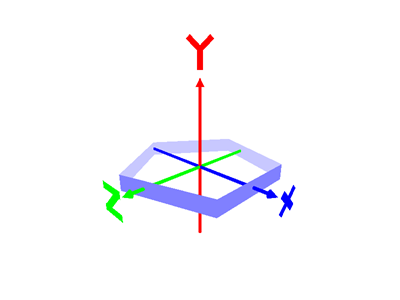 　
　　(例)正12面体を作る。 
　　　　一辺をz軸に揃える： t -np.cos(np.deg2rad(36)) 0 0 
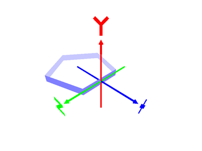 　
　　　　z軸に沿って折り曲げる(五角形を起こす)：r 0 0 -63.5 
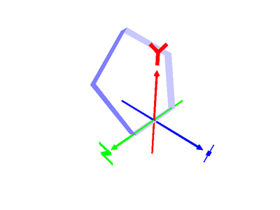 　
　　　　回転したときに底辺が五角形になるように平行移動する：t -np.cos(np.deg2rad(36)) 0 0 
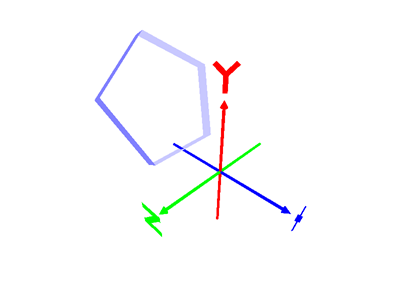 　
　　　　y軸周りに72°回転を5回繰り返す：r 0 72 0 5 
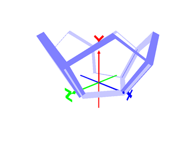 
　　　　正12面体の半分を一旦セーブ：save dodecahedron_half.ply 
 
　　　　裏返しにする：r 0 0 180 
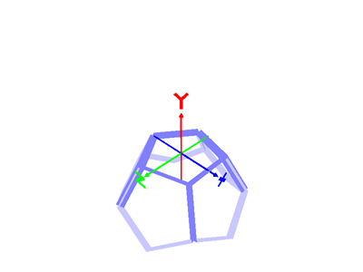 　
　　　　下半分をロードする前に持ち上げる：t 0 np.sin(np.deg2rad(36))*np.sin(np.deg2rad(63.5))*5 0 
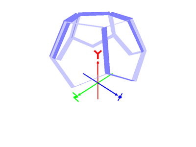 　
　　　　下半分をロードする：l dodecahedron_half.ply 
 
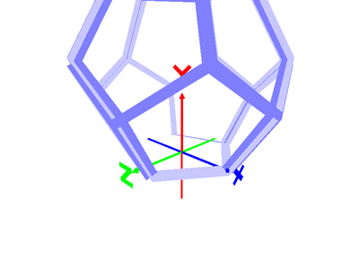 　

</body>
</html>