<html lang="ja">
    <head>
        <meta charset="utf-8" />
    </head>
    <body>
<h1>
PLY Editor
</h1>
<h2>なにものか？</h2>

　簡単な形状のPLY(プリミティブ)作成と、それを回転・スケーリング・平行移動するだけのエディターです。 
 
　(例) 円盤を回転・スケーリング・平行移動してメッシュを作成。

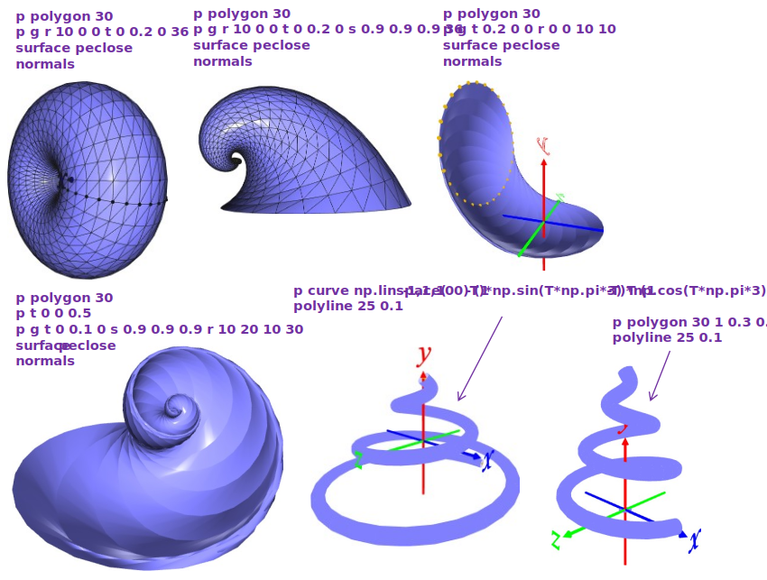

<h3>環境構築</h3>

　pip install Open3D 
　pip install mapbox_earcut　･･･　img2mesh で使用 
　pip install imageio　　　　･･･　img2gif.py で使用 
　pip install mediapipe==0.10.14　･･･　img2facemesh.py, img2fingers.py, img2skeleton.pyで使用 
　pip install manifold3d　　 ･･･　Boolean.py で使用 
　pip install plyfile　　　　･･･　ply2skeleton.py で使用 
　pip install scikit-image　 ･･･　implicit_function.py で使用 

<h3>チュートリアル</h3>

　チュートリアルは <a href="https://boyoyon.github.io/PLY_EDIT/tutorial/tutorial.html">こちら</a>

<h3>更新項目</h3>

　<strong>implicit_function.py</strong>　･･･　PLY_interactive.py とは別の即席の陰関数モデリングツール 
　python　implicit_function.py　(式) 
　・後でウラ面、オモテ面の色を別々に設定できるように 
　　ウラ面＋オモテ面(implicit.ply), オモテ面(implicitA.ply), ウラ面(implicitAA.ply)を保存。 
　・aキー押下で座標軸表示/消すをトグル。 
　・cキー押下で、矢印キー押下時にスクリーンキャプチャーする/しないをトグル。 
　・7/8キーで矢印キーで調整するlevel値のステップを小さくする/大きくする。 
 
　(例)エイリアンっぽい 
　　python implicit_function.py ((x**2)+(y**2)+(z**2)+2*y-1)*((x**2+y**2+z**2-2*y-1)**2-8*z**2)

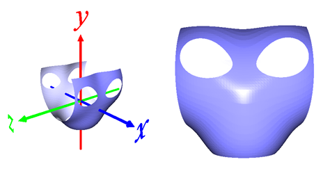

　(例)サンゴっぽい 
　　python implicit_function.py x+np.sin(4*x)*np.cos(4*y)+np.sin(4*y)*np.cos(4*z)+np.sin(4*z)*np.cos(4*x)

　　python implicit_function.py x+y**2+z**3

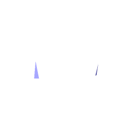

　python implicit_function.py x**3+y**3+z**3-3*x*y-3*y*z-3*z*x

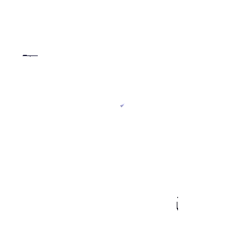

　　python implicit_function.py (1-np.sqrt(x**2+y**2))**2-z**2 
　　(トーラスの式の +z**2 を -z**2 に変えてみた)

　　python implicit_function.py np.sin(3*x)*np.cos(3*y)+np.sin(3*y)*np.cos(3*z)+np.sin(3*z)*np.cos(3*x) 
　　(<a href="https://ja.wikipedia.org/wiki/ジャイロイド">ジャイロイド</a>)

　<strong>地形っぽい面の作成</strong> 
　　python　src\create_terrain.py 
 
　　terrainA.ply　(オモテ面) 
　　terrainAA.ply (ウラ面)　　

　<strong>フィルター</strong> 
　filter　(x/-x/y/-y/z/-z/X/-X/Y/-Y/Z/-Z) 
　・x　　三角形の頂点の１つが x > 0 ならば削除 
　・-x　 三角形の頂点の１つが x < 0 ならば削除 
　・X　　三角形の頂点すべてが x > 0 ならば削除 
　・-X　 三角形の頂点すべてが x < 0 ならば削除 
　　(他も同様) 
　Points[] に対しては 
　p　filter　(x/-x/y/-y/z/-z) 

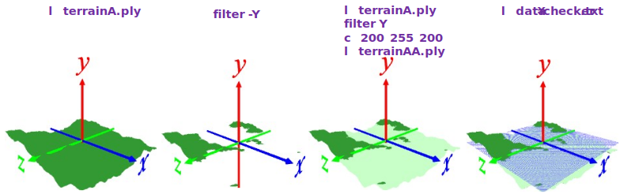

　python　src\display_opaque_translucent_mesh.py　(不透明mesh)　(半透明mesh) 
　(例) 
　python src\display_opaque_translucent_mesh.py data\terrainA.ply data\plane.ply　　

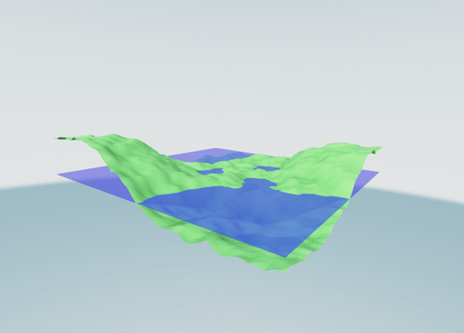

　<strong>簡易彫刻</strong> 
　python src\sculpt.py 
　(Visualizer画面上で) 
　　矢印キー　･･･　ドリルの位置変更 
　　fキー　　 ･･･　ドリルをターゲットに近づける 
　　bキー　　 ･･･　ドリルをターゲットから離す 
　　mキー　　 ･･･　削り開始位置をマーキング 
　　dキー　　 ･･･　マーキング位置からdキー押下位置まで削る 
　　uキー　　 ･･･　undo 
　(コンソール画面上で) 
　　save　　　･･･　plyにセーブする

　<strong>歯車の点列生成</strong> 
　p　gear　(サイズ)　(歯の高さ)　(歯の本数) 
　(例) 
　l　data\gear2.txt

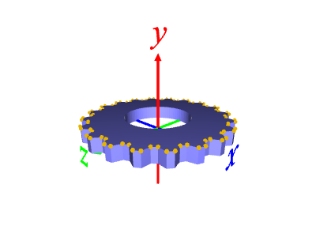
<h3>使い方</h3>

<h4>起動・終了</h4>

<strong>起動</strong> 
 
python PLY_interactive.py [(幅) (高さ)] 
・引数で Visualizer 画面の幅、高さを指定可能。 
　起動後でもサイズ変更可能。 
 
　コンソールにコマンドを入力すると結果が Visualizer 画面に表示される。 

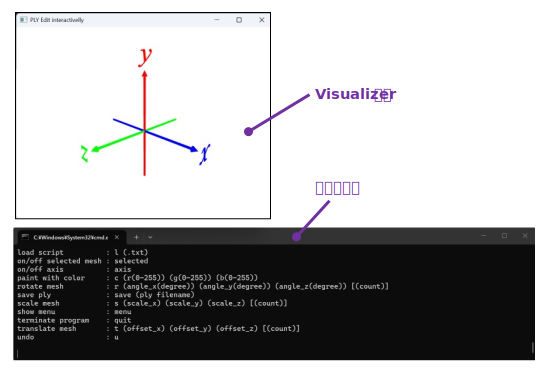

　(基本操作) ･･･ [ ]はオプション 
　・m　　　　　　　　　　　　　　　　･･･　メニューを表示する 
　・axis　　　　　　　　　　　　　　　･･･　座標軸を消す⇔表示する 
　・l　(.plyファイル)　　　　　　　　　･･･　PLYファイルをロードしメッシュを表示する 
　・r　(x回転角)　(y回転角)　(z回転角)　･･･　メッシュを回転する 
　・s　(x倍率)　(y倍率)　(z倍率)　　　　･･･　メッシュを拡大/縮小する 
　・t　(x移動量)　(y移動量)　(x移動量)　･･･　メッシュを移動する 
　・merge　　　　　　　　　　　　　　･･･　メッシュをマージする 
　・normals　　　　　　　　　　　　　･･･　法線を計算する / 削除する。 
　・d　[all]　　　　　　　　　　　　･･･　メッシュを削除する。[all]は全部削除。 
　・u　　　　　　　　　　　　　　　　･･･　前の操作を取り消す 
　・cap　[ファイル名]　　　　　　　　･･･　Visualizer 画面をキャプチャーする 
　・save　(.plyファイル)　　　　　　　･･･　メッシュを保存する 
　・quit　　　　　　　　　　　　　　　･･･　終了する 
 
　※ パラメータにスペースを含めることはできない。 
　※ 実数値パラメータには numpy 関数(np.***) を含んだ式を指定することができる。 

<h4>Visualizer 画面でのキー操作</h4>

※ 元の Visualizer 操作キーは, hキー押下でコンソールに表示される。 
 
カスタマイズしたキー操作  
・x　･･･　x軸方向からのビュー 
・y　･･･　y軸方向からのビュー 
・z　･･･　z軸方向からのビュー 

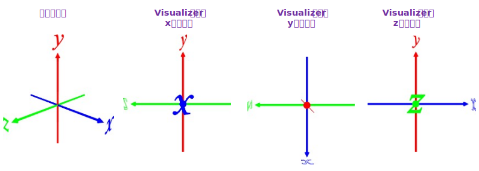

・1/2/3　･･･　カメラ位置の回転。+Shiftで逆方向回転。+Ctrlで回転量増加 
・4/5/6　･･･　カメラ位置の移動。+Shiftで逆方向移動。+Ctrlで移動量増加 
・7/8　　･･･　回転/移動ステップの増減。+Shiftで増加 
・↑↓　 ･･･　ズーム(6, Shtft+6と同じ) 
・→←　 ･･･　移動(4,Shift+4と同じ) 

<h4>コンソールからの Visualizer 制御</h4>

・getEyePos　･･･　カメラパラメータの取得 
・setEyePos　･･･　カメラパラメータの設定 
 
・cam x　　　　　　　　　　･･･　x軸方向からのビュー 
・cam rotate x (角度)　　　･･･　x軸周りに回転 
・cam rotate -x (角度)　　　･･･　x軸周りに逆回転 
・cam rotate x (-角度)　　　･･･　(同上) 
・cam translate x (移動量)　･･･　x軸方向に平行移動 
・cam translate -x (移動量)　･･･　x軸方向に平行移動 
・cam translate x (-移動量)　･･･　(同上) 
 
※ y, zについても同様のコマンドあり。 

<strong>終了</strong> 
 
・Visualizer 画面で ESC キー押下 
　または 
・コンソールに quit と入力する。 

<h4>ロード・セーブ:　l コマンド / save コマンド</h4>

<strong>ロード</strong> 
 
・l　( .ply ファイル)　･･･　PLYファイルが読み込まれ Visualize 画面に表示される。 
 
・l　( .txt ファイル)　･･･　コマンド列が記述されたファイルが読み込まれ実行される。 
　　　　　　　　　　　　　　※ もう一回エンターキーを押すと実行される。 
・l　( .npy ファイル)　･･･　座標データが読み込まれ Points[ ]に格納される。 
　　　　　　　　　　　　　　※ 後でPoints[ ]を使うコマンドを実行するまで外観上変化はない。

 
<strong>セーブ</strong> 
 
・save　( .ply ファイル)　･･･　メッシュを指定されたファイルにセーブする。 
　　　　　　　　　　　　　　編集中のすべてのメッシュがマージされてセーブされる。

<h4>回転/スケーリング/平行移動/グループ:　r コマンド / s コマンド / t コマンド / g コマンド</h4>

<strong>回転</strong> 
　r (x 軸周りの回転角度)　(y 軸周りの回転角度)　(z 軸周りの回転角度)　[(回数)] 
　・角度は度数(degree)で指定する。

    
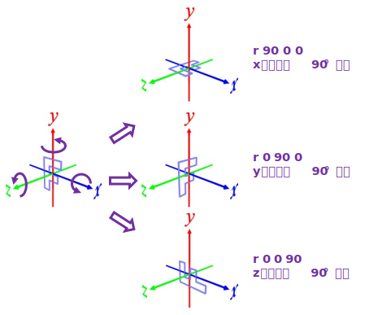

回数パラメータを指定すると, オリジナル＋(回数-1)回, 回転されたメッシュが作成される。

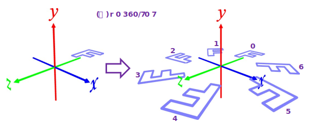

<strong>スケーリング</strong> 
　s (x 軸方向のスケーリング)　(y 軸方向のスケーリング)　(z 軸方向のスケーリング)　[(回数)]

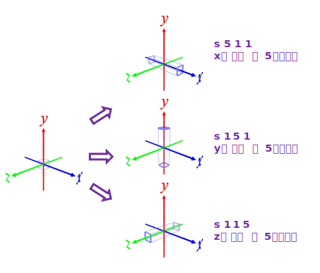

回数パラメータを指定すると, オリジナル＋(回数-1)回, スケーリングされたメッシュが作成される。

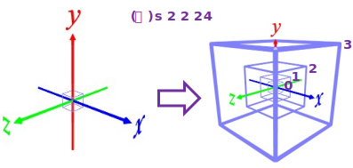

<strong>平行移動</strong> 
　t (x 軸方向の平行移動量)　(y 軸方向の平行移動量)　(z 軸方向の平行移動量)　[(回数)]

 

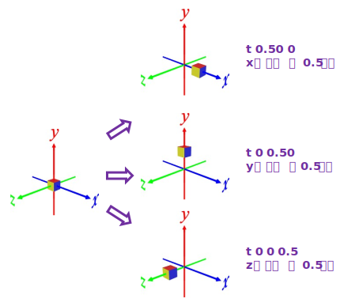

回数パラメータを指定すると, オリジナル＋(回数-1)回, 平行移動されたメッシュが作成される。

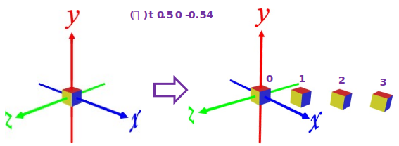

<strong>グループ</strong> 
　g 　(rコマンド/sコマンド/tコマンドの任意の並び)　[(回数)]

 

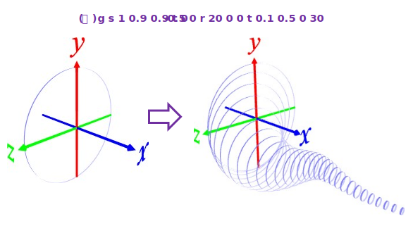

<h4>正多角形:　polygon コマンド</h4>

<strong>厚みのない正多角形</strong>

polygon (正多角形の辺の数) [(外接円半径)･･･]

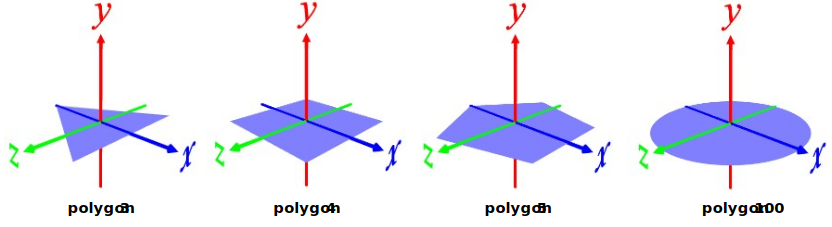

<strong>厚みのある正多角形</strong>

polygon (正多角形の辺の数) [(外接円半径) (厚み)･･･] 
・天板, 底面,側面の 3 つのメッシュが作成される。 
・大文字(POLYGON)で指定すると, 天板, 底面, 側面がマージされた 1 つのメッシュが作成される。 
・厚みにマイナスを指定すると側面のみ(天板, 底面なし)のメッシュが生成される。

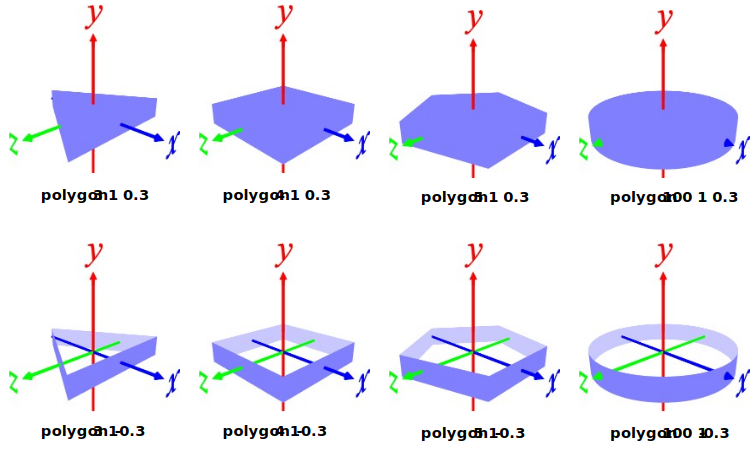

　<strong>polygon border</strong> 
　多角形の borderのみのメッシュを生成する。 
　・polygon_border　(画数)　(外接円半径)　(幅)　[(表の色：rgb)　(裏の色：rgb)] 
　※ 厚みはない。 

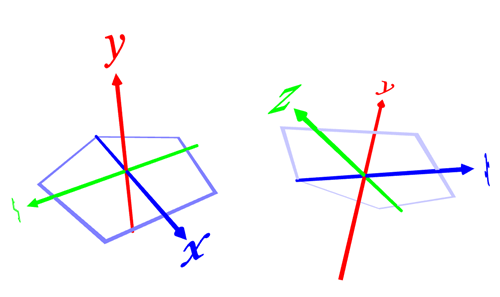

(例)

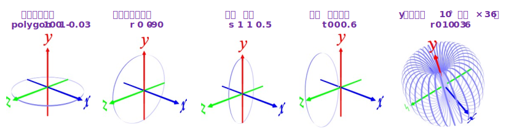

(例)

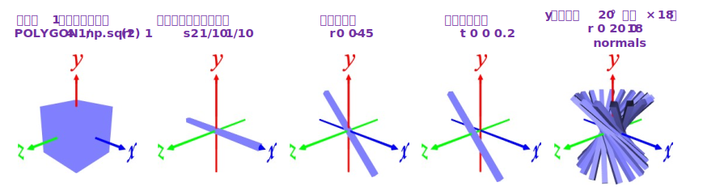

<strong>正多面体</strong>

正多角形を回転/スケーリング/平行移動することで正多面体を作る。 
l (スクリプト) # スクリプトファイルをロードして実行する。

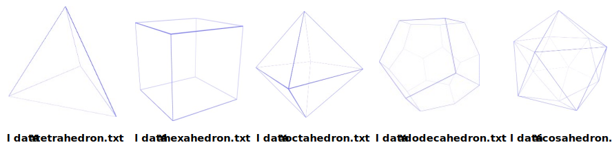

<strong>(例) 回転と平行移動で正五角形から正12面体を作る</strong>

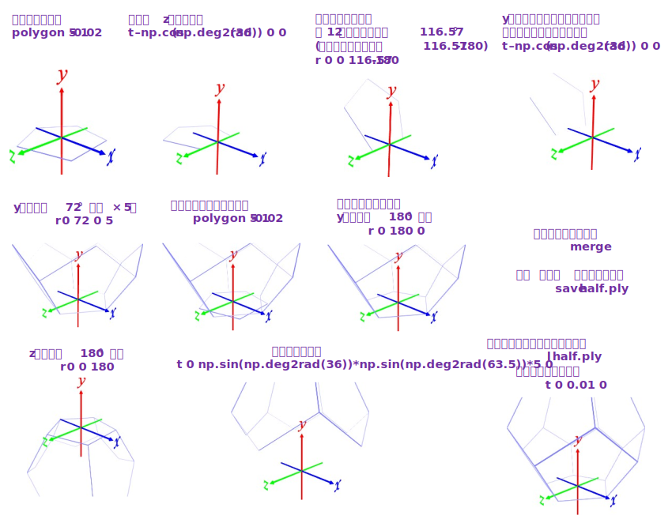 

<strong>螺旋</strong>

多角形の側面を作成しつつ y 軸方向に移動させることで螺旋を作ることができる。 
polygon (多角形の辺の数) (外接円半径) (厚み) (螺旋高さ) (回転数) (最終半径)

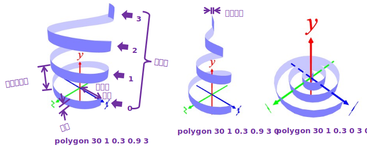

<h4>色指定: c コマンド, 環境変数</h4>

　<strong>c コマンド：メッシュの単色塗りつぶし</strong> 
　　c　(red 成分:0～255)　(green 成分:0～255)　(blue 成分:0～255)

　<strong>cコマンド：色セットの選択　</strong> 
　<strong>　default/red/green/blue/pink/orange/cyan/white/gray/black オプション</strong> 
　　SurfaceOuter/SurfaceInner/LateralOuter/LateralInner/PaddingOuter/PaddingInner 
　を設定するオプション 
 
　<strong>cコマンド：色セットのpush/pop　</strong> 
 
　　SurfaceOuter/SurfaceInner/LateralOuter/LateralInner/PaddingOuter/PaddingInner 
　を push/pop する 

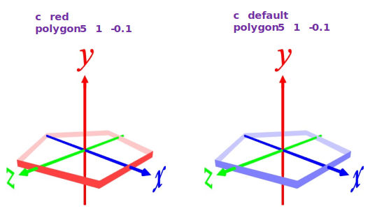

　<strong>環境変数</strong> 
　　天板・底面の表：SurfaceOuter (red 成分:0～255)　(green 成分:0～255)　(blue 成分:0～255) 
　　天板・底面の裏：SurfaceInner (red 成分:0～255)　(green 成分:0～255)　(blue 成分:0～255) 
 
　　側面の表　　　：LateralOuter (red 成分:0～255)　(green 成分:0～255)　(blue 成分:0～255) 
　　側面の裏　　　：LateralInner (red 成分:0～255)　(green 成分:0～255)　(blue 成分:0～255) 
 
　　padding の表　：PaddingOuter (red 成分:0～255)　(green 成分:0～255)　(blue 成分:0～255) 
　　padding の裏　：PaddingInner (red 成分:0～255)　(green 成分:0～255)　(blue 成分:0～255) 
　　※ padding については 折れ線：polyline コマンドで説明する。

　(例) 
　　　l  data\pole.txt 
　　　(一部) 
　　　　LateralOuter 255 0 0　　　# 側面(表)を赤に設定 
　　　　LateralInner 255 230 230　# 側面(裏)をうすい赤に設定 
　　　　polygon 100 0.5 0.1 0.6 4 # 螺旋を作成 
　　　　save spiral_red.ply　　　 # セーブ 
 
　　　　LateralOuter 0 0 255　　　# 側面(表)を青に設定 
　　　　LateralInner 230 230 255　# 側面(裏)をうすい青に設定 
　　　　polygon 100 0.5 0.1 0.6 4 # 螺旋を作成 
　　　　r 0 180 0　　　　　　　　 # y 軸周りに 180°回転 
　　　　save spiral_blue.ply　　　# セーブ 

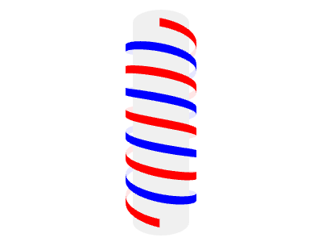

<h4>メッシュの選択:　select コマンド, selected コマンド</h4>

　以下のようにしてメッシュを選択する。(使い勝手が悪い･･･) 
 
　(例) 
　　l　data/pole.txt 
　　select　･･･　選択可能なメッシュ一覧がコンソールに表示される。 
 
　　select from  ['', 'polygon100_side', 'spiral_red', 'POLYGON100'] 
 
　　名前を指定してメッシュを選択する。 
　　select　polygon100_side 
 
　　選択されたものだけ表示。 
　　selected  
 
　　もう一回 selected を実行すると全メッシュを表示する。

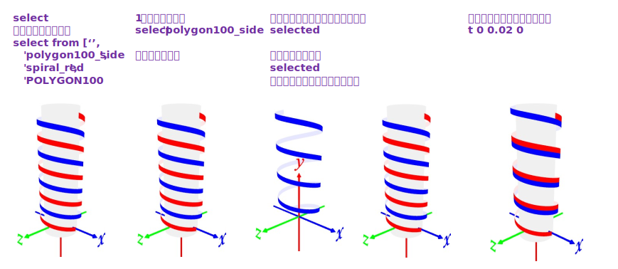

<h4>球面:　sphere コマンド</h4>

sphere (半径)　(分割数)　(緯度開始角)　(緯度終了角)　(経度開始角)　(緯度終了角) 

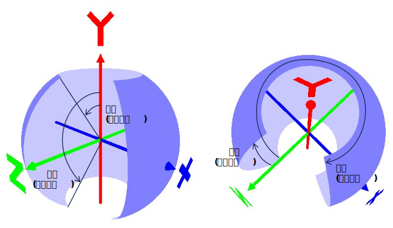

分割数による外観の違い

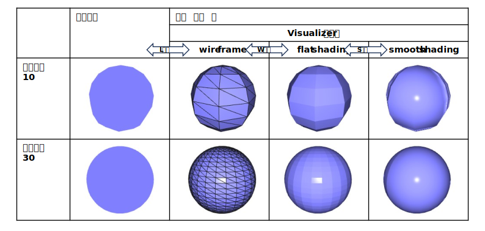

　<strong>sphereコマンド派生：　sphereAA コマンド</strong> 
　・法線が視点方向の球面のみを表示する。 
　　(例) 
　　sphereAA　0.75　100 
　　normals 
　　polygon　100　0.74　-0.02 
　　r　0　0　90 
　　polygon　100　0.74　-0.02 
　　r　90　0　0 
　　polygon　100　0.74　-0.02 
　　※ Visualizer で ＠キーを押して画角を狭めた方が効果的。 

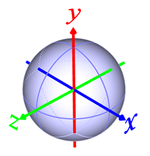

<h4>3D座標:　p コマンド, getPoints コマンド</h4>

　Points 配列に 3D座標を格納する。 
　後で distribute コマンド, polyline コマンド,などを実行する際に参照される。 
　使用例は distribute コマンド, polyline コマンドなどで説明する。 
 
　・ p　･･･　現在の Points 配列の内容を表示する。 
　・ p clear　･･･　Points 配列を空にする。 
　・ p　(x 座標)　(y 座標)　(z座標)　･･･　Points 配列に座標を追加する。 
　・ p　centering　･･･　Points配列内の座標をセンタリングする  
　・ p　r　xx　xx　xx　･･･　Points配列内の座標の回転  
　・ p　s　xx　xx　xx　･･･　Points配列内の座標のスケーリング  
　・ p　t　xx　xx　xx　･･･　Points配列内の座標の平行移動  
　・ p　save　( .npyファイル名)　･･･　Points配列内の座標を .npy ファイルに保存 
　※ getPoints　　　　　　　　　　　･･･　メッシュから頂点データを抽出し Points 配列に格納する。 
　・ GETPoints　　　　　　　　　　　･･･　メッシュから頂点データを抽出し Points 配列に追加する。 
　※ l　(.npyファイル)　　　　　　　･･･　.npy ファイルから 3D座標データを読み込み Points 配列に格納する。 
　※ p　(polygon コマンド)　　　　　･･･　polygon コマンドの生成する座標を Points 配列に格納する。 
　※ p　curve　(T パラメータの範囲式)　(T を使った x 座標式)　(T を使った y 座標式)　(T を使った z 座標式) 
　　　　　　　　　　　　　　　　　･･･　パラメータ T による曲線座標を Points 配列に格納する。 
 
　先頭に ※ のついているコマンドは, 実行前に Points 配列をクリアする。 

　<strong>マーカー表示</strong> 
　　3D 座標は polyline コマンド, distribute コマンドなどでメッシュ化しないと, 
　　どうなっているかわからなかったので、マーカー表示するようにした。 
　　p　disp　･･･　Points 配列内座標のマーカー表示 on/off をトグルする。 
　　(例) 
　　p　1　1　0　　･･･　3D 座標 (1,1,0) を追加する 
　　p　-1　-1　0　･･･　3D 座標 (-1,-1,0) を追加する 
　　p　clear　　　･･･　3D 座標を空にする 
　　l　data/f.txt　･･･　「F」字の頂点座標を読み込む 
　　p　t　0.4　0.4　0　･･･　座標軸と重なって見にくいので 3D 座標を平行移動する

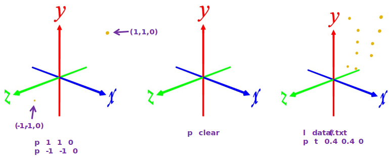

　<strong>3D座標:　回転/スケーリング/平行移動/組み合わせの複数回実施</strong> 
　　メッシュに対して回転/スケーリング/平行移動/組み合わせを複数回できるが、 
　　同様のことを 3D座標に対しても適用できるようにした。 

　　回転/スケーリング/平行移動/組み合わせを複数回実施した点を使って面を張る。 
　　surface　[pclose/eclose/peclose] 
　　(例) 
　　　p　polygon　30　･･･　正30角形の頂点 
　　　p　r 0　0　-90　･･･　3D 座標群を z 軸周りに90°回転 
　　　p　g　s　1　0.9　0.9　t　0　-0.5　0　r　20　0　0　t　0.1　0.5　0　30 
　　　･･･　スケーリング/平行移動/回転を組み合わせた変換を30回実施 
　　　surface　･･･　変換途中の座標を使って面を張る 

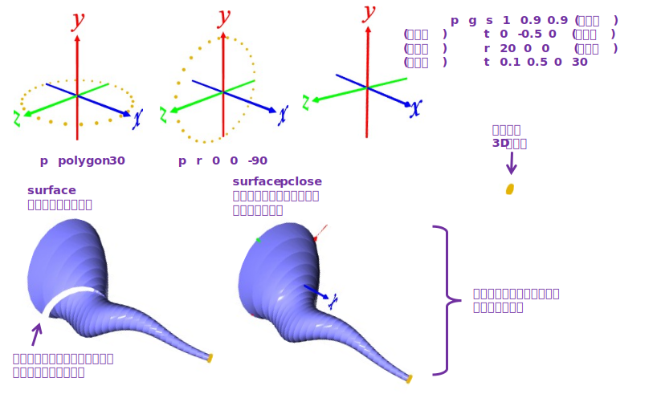

　　surface コマンドのパラメータ：　pclose/eclose/peclose 
　　※ テキトーに付けた名前 
　　　 3D 座標列の path 方向の最後と最初を閉じる 
　　　 押し出し(extrusion)方向の最後と最初を閉じる 

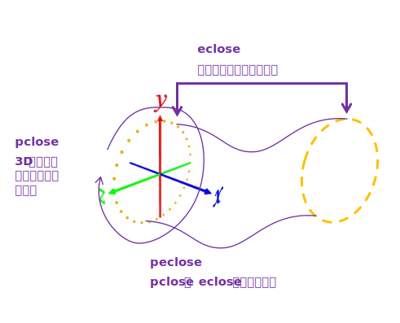

　　(例) eclose が有効な例 
　　　draw　･･･　手書きで 2D 曲線を入力する 
　　　p r 0 10 0 36　･･･　2D 曲線を360°回転して器っぽいものを作る。 

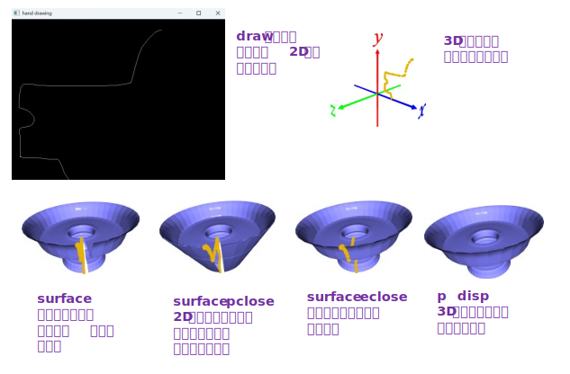

　　(例) pclose が有効な例 
　　　l　data/f.txt　･･･　「F」字の頂点データをロード 
　　　p　t　0.2　0.2　0　･･･　3D座標を平行移動(座標軸と重なって見ずらいため) 
　　　p　t　0　0　0.2　2　･･･　z 軸方向に 0.2 移動(押し出す) 
　　　※ count ≧ 2 にしないと面を張れない。 
　　　surface　･･･　「F」の底辺がつながらない 
　　　surface　pclose　･･･　底辺がつながる

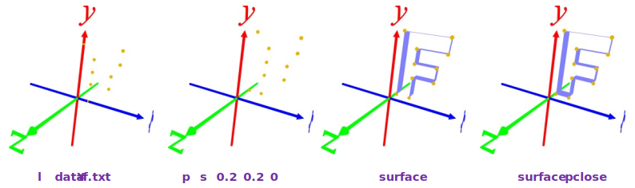

　<strong>3D座標配列関連のコマンド・オプション</strong> 

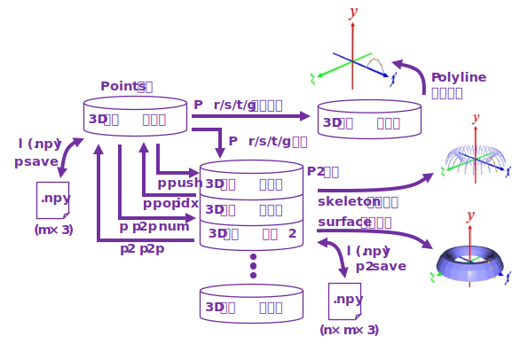

　<strong>p2コマンド：　p2pオプション</strong> 
　　P2[ ] 内の n,m,3 データを n×m, 3 データに reshape して Points[ ] に格納する。

　<strong>pコマンド: p2pオプション　(num)</strong> 
　　Points[ ] を (num) 個のシーケンスに分割して P2[ ]に移動する。 
　　Points[ ] にはシーケンスの最後の点が格納される。

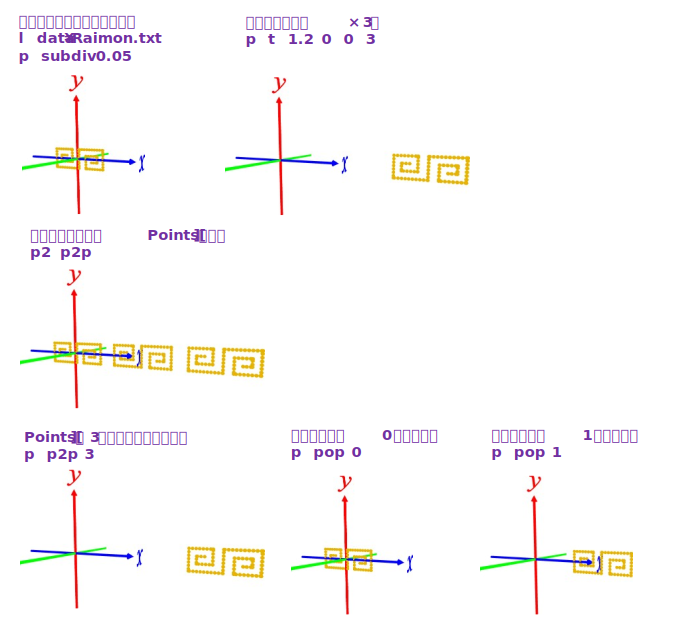 

　<strong>3D座標配列(p2)のload、save</strong> 
　・l　***.npy　･･･　numpy 配列の形状で Points か P2 かを自動判断する 
　・p2　save　　･･･　p2配列が　.npy にセーブされる

　<strong>pコマンド:　subdiv オプション</strong> 
　　点と点の間を細分化する。あとの twist オプションなどで必要になる。 
　　p　subdiv　(細分化の長さ)　･･･　最後の点と最初の点の間は細分化しない 
　　p　SUBDIV　(細分化の長さ)　･･･　最後の点と最初の点の間は細分化する

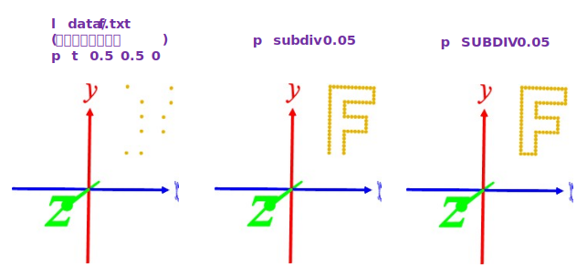

　(細分化の長さ) を決めるための参考情報 
　(例) 
　　l　data/f.txt　　　　　　　･･･　「F」字の頂点データをロード 
　　(エンターキー押下)　　　　 ･･･　スクリプト実行 
　　p　i　　　　　　　　　　　 ･･･　3D 座標データの情報表示 
 
　　x　0.600000　0.000000　-　0.600000 
　　y　0.900000　0.000000　-　0.900000 
　　z　0.000000　0.000000　-　0.000000 
　　length between adjacent points: 0.200000 - 0.900000　･･･　細分化前の点と点の間隔は最小 0.2 

 

　<strong>pコマンド:　twist オプション</strong> 
　　p　twist　(x/z/z)　(ねじる角度) 

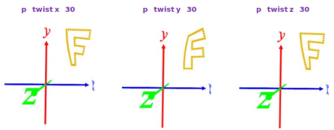

　(twist オプションの利用例) ツイストする雷門 

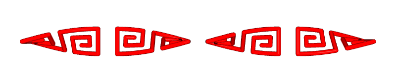 

　<strong>pコマンド:　surface オプション</strong> 
　　p　surface　(xの範囲)　(zの範囲)　(y=f(x,z)の式) 
　(例) 
　　p　surface　np.linspace(-1,1,100)　np.linspace(-1,1,100)　0.1*np.sin(np.sqrt(x**2+z**2)*np.pi*2) 
　(例) 
　　p　surface　np.linspace(-1,1,100)　np.linspace(-1,1,100)　0.3*np.random.rand(100,100) 

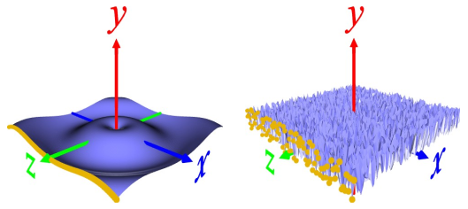

・p surface → surface　コマンドでメッシュ化 → 五角形や三角形に剪定 
・正 12 面体や正 20 面体を作成するスクリプトで p polygon の代わりに 
　剪定した メッシュをロードすると･･･

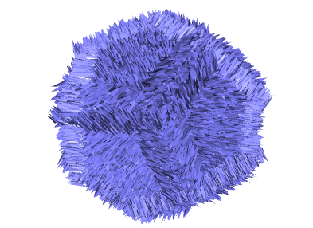

　<strong>surfaceコマンド：パラメータ　Eclose</strong> 
　押し出し方向の最後と最初を接続する際、indexの同じ点ではなく、距離の近い点を接続する。 
　(例) 
　　裏と表がつながるような場合に使用する。 
　　l　data\kline.npy　･･･　クラインの壺の頂点列をロード 
　　surface　Eclose　0　10　･･･　P2(Pointsの履歴)の 0～10 をメッシュ化 
　　p2　transpose　･･･　P2 (Points の履歴)を転置(後述) 
　　p　pop　0　･･･　転置した履歴の 0番目 (断面)　を Points に読み込む 
　　LateralOuter　255　128　255　･･･　側面色をピンクに設定 
　　polyline　25　0.06　･･･　断片をピンクの折れ線でメッシュ化 
　　p　pop　11　･･･　もう一方の断面(indexが1個ずれる･･･)をPointsに読み込む 
　　LateralOuter　255　200　64　･･･　側面色をオレンジに設定 
　　polyline　255　0.06　･･･　もう一方の断面をオレンジの折れ線でメッシュ化 
    save　kline_cut_model.ply　･･･　メッシュをセーブ 
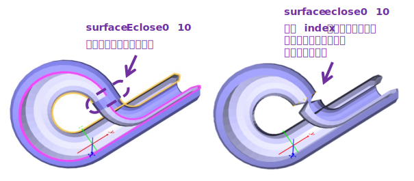 

　<strong>surfaceコマンド：パラメータ　start　end</strong> 

　　表面の生成を開始、終了する path 方向の index を指定できるようにした。 
　　上の、クラインの壺の内部を表示する場合などに利用できる。 

　<strong>p2コマンド：パラメータ　transpose</strong> 

　　path 方向と extrusion 方向を入れ替える。 
　　start, endパラメータを使ってカットモデルを作成した場合の断面表示などで利用できる。 
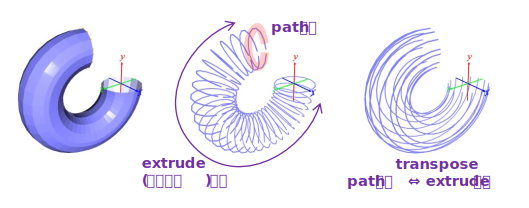 
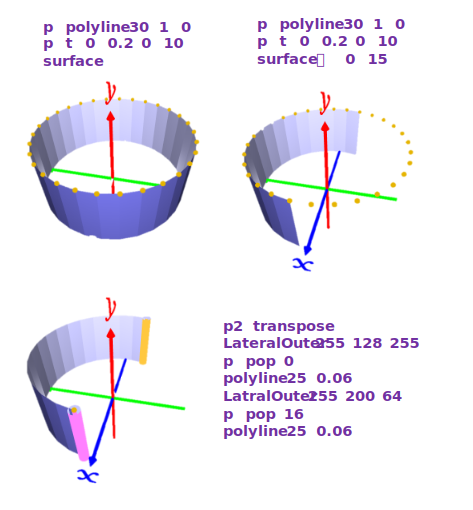 

　<strong>p2コマンド：パラメータ　reverse　(p/e)</strong> 

　　path方向、extrusion方向のindexを逆順に付け替える、 
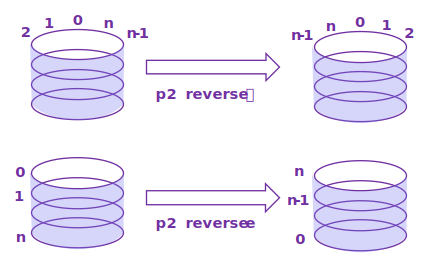 

　

　<strong>surfaceコマンド：　surfaceコマンド,　sideA コマンド, sideAA コマンド</strong> 
　・surface コマンド ･･･ 面の法線方向によらずメッシュ化する 
　・sideAA コマンド　･･･ 面の法線が視点方向のもののみメッシュ化する 
　・sideA コマンド　･･･　面の法線が視点方向と反対方向のもののみメッシュ化する 
　※ 頂点の index の振り方によって変わるので, sidaA / sideAA コマンドを試して確認する必要あり。 
　(例) 
　　l　data/KleinBottle.npy　 
　　sideAA　pEclose

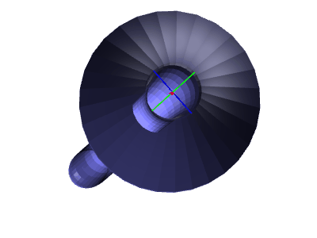

<h4>配置:　distribute コマンド</h4>

Points 配列に格納されている座標にメッシュを配置する。 
・distribute　( .plyファイル)　･･･　.plyファイルを読み込み、配置する。 
　　原点→配置場所方向に向けたい場合はオプション「radial」を指定する。 
　　配置場所→原点方向に向けたい場合はオプション「-radial」を指定する。 
 
・distribute sphere (サイズ)　･･･　球を生成し配置する。 

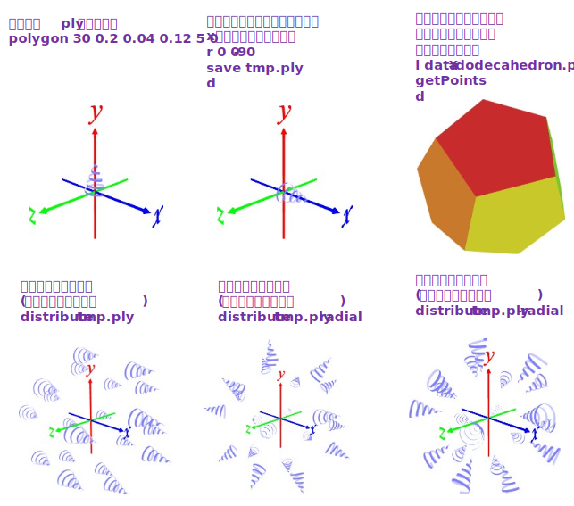

<h4>折れ線:　polyline コマンド, POLYLINE コマンド</h4>

Points 配列の点を折れ線(パイプ)で接続する。 
・polyline　[(断面の画数)　(断面の半径)　(比率)]　終点と始点をつながない。すき間を padding する。 
・POLYLINE　[(断面の画数)　(断面の半径)　(比率)]　終点と始点をつなぐ。　　すき間を padding する。 
・poly-line　[(断面の画数)　(断面の半径)　(比率)]　終点と始点をつながない。すき間を padding しない。 
・POLY-LINE　[(断面の画数)　(断面の半径)　(比率)]　終点と始点をつなぐ。　　すき間を padding しない。 　
 
　<strong>断面の画数と断面の半径</strong> 
　・デフォルトの画数：25 
　・デフォルトの半径：0.02 

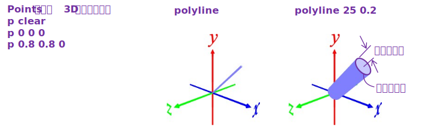

　<strong>ハイフンありとハイフンなし, 小文字と大文字</strong> 
　　折れ線接続した際に、曲がり角でパイプとパイプの間にすき間ができる。 
　　・ハイフンなし：　すき間を padding する。 
　　・ハイフンあり：　すき間を padding しない。 
　　・小文字：　終点と始点をつながない。 
　　・大文字：　終点と始点をつなぐ。 

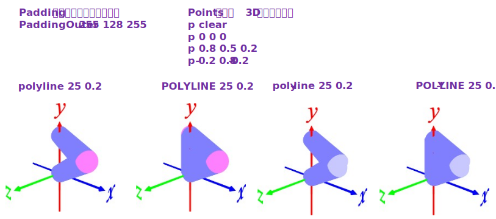

　<strong>比率</strong> 
　　点と点をパイプで覆う比率を設定する。 
　　・1.0(デフォルト)：　完全に覆う。 
　　・0.0：　　　　　　　全く覆わない。(padding のみ) 
　　・0 ＜, ＜ 1：　　　 　部分的に覆う。(破線。padding がじゃまな場合はハイフンありコマンドを使う) 

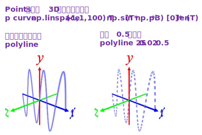

　ratio = 0の使用例

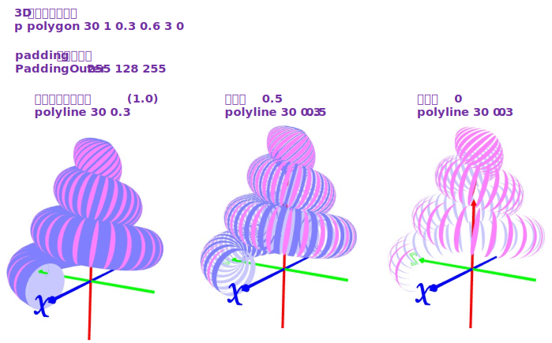

　<strong>折れ線の始端・終端処理</strong> 
　パラメータの指定で折れ線の始端・終端にキャップを付けることができる。 
　　polyline　(断面の画数)　(断面の半径)　(比率)　(始端のキャップ)　(終端のキャップ) 
　　(例) 
　　polyline　25　0.02　1　sphere　sphere 

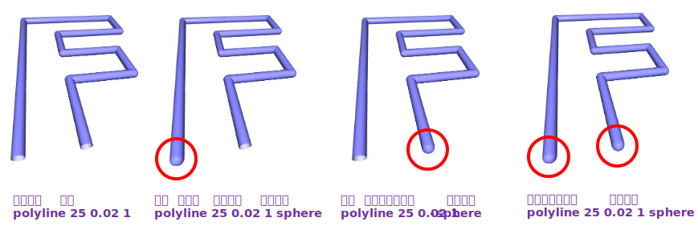

　キャップが裏返しになる場合があり, 手動で設定する必要がある･･･ 
　・sphere　･･･　裏返さない 
　・-sphere　･･･　裏返す 
　(例) 
　　l　data/raimon.txt 
　　polyline　25　0.02　1 shpere　sphere 

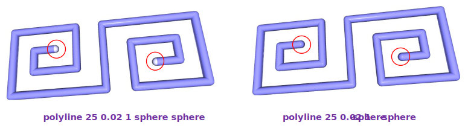

　<strong>折れ線の使用例</strong> 
　　他のソフトウェアで作成した 3D 軌道データを PLY 化する。 
　　　l  data\chaos_trajectory.npy　･･･　10,000点のカオス軌道データ 
　　　poly-line 
 
　　※ padding 処理は地味に重いので, 点の数が多い場合はハイフンありを使った方が良い。 
　　　 ハイフンなし(polyline)で実行すると, すごく時間が掛り, 作成されるメッシュも巨大になる。 

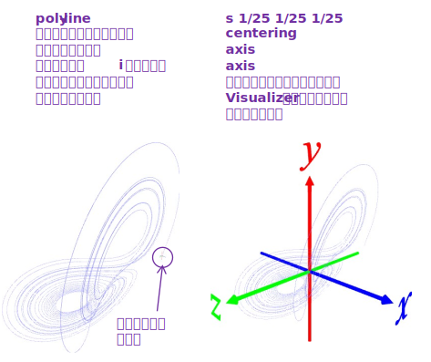

　<strong>画像からのメッシュ作成</strong> 
　img2mesh　(画像ファイル名) 
　コンソールから実行できるようにした。表, 裏の2メッシュ＋輪郭の座標がロードされる。 
　・背景が黒でないとうまく動作しない。 
　・表と裏は select してみないとわからない.  

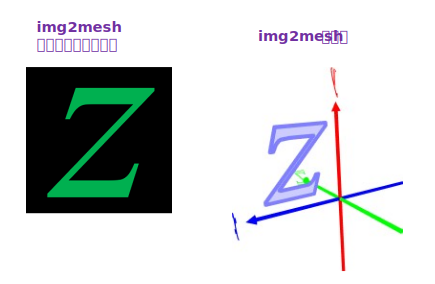

　<strong>手書き入力：　draw コマンド</strong> 
　draw　[(入力画面幅)　(入力画面高さ)　(モード)] 
　※ (今のところ)一筆書きのみ。思い付きで実装したがいまいち ･･･ 
　　　モード指定なしだと、z 座標は 0 固定。 
　　　モードに 1 を指定すると z 座標は 0.01ずつ増える。 

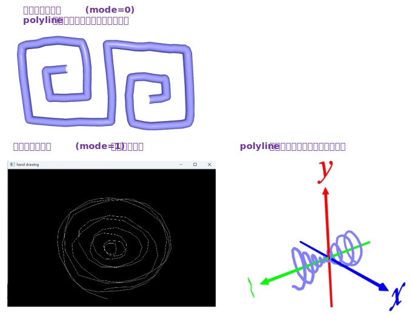

<h4>その他コマンド</h4>

　<strong>ループ実行：　loop start/quit/end [count]</strong> 
　　指定したコマンド列を count 回数繰り返す。 
　　(例) 
　　　[ 0]　python src\PLY_interactive.py 400 300 # 画面サイズを指定して起動 
　　　[ 1]　l　data/f.txt　　　　# F の頂点データ読み込み 
　　　[ 2]　(エンターキー押下)　# スクリプト実行 
　　　[ 3]　POLYLINE　　　　　　# F の輪郭の折れ線メッシュを作成する 
　　　[ 4]　(Visualizer画面をドラッグしカメラ位置を設定する) 
　　　[ 5]　getEyePos　　　　　 # カメラ位置を保存する 
　　　[ 6]　del 0*.png　　　　　# 不要なキャプチャー画像を削除 
　　　[ 7]　loop start　　　　　# ループコマンド列の入力を始める 
　　　[ 8]　cap　　　　　　　　 # スクリーンキャプチャー 
　　　[ 9]　r 0 10 0　　　　　　# y軸周りに10°回転 
　　　[10]　setEyePos　　　　　 # カメラ位置を復元する 
　　　[11]　loop end 36　　　　 # ループコマンド入力完了。36回繰り返す 
　　　[12]　(エンターキー押下)　# スクリプト実行 
　　　[13]　python　src\img2gif.py　0*.png　15　0 # 15fps, 無限繰り返しでgif化

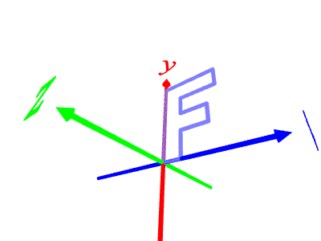

　<strong>メッシュ情報表示</strong> 
　　i 
　メッシュのx軸, y軸, z軸の幅, min, maxを表示する。 
　(例) 
　　x　4.799944　-2.399972　-　2.399972 
　　y　4.666745　-2.333372　-　2.333372 
　　z　4.874035　-2.437017　-　2.437017 

　<strong>センタリング</strong> 
　　centering 
　　(例)

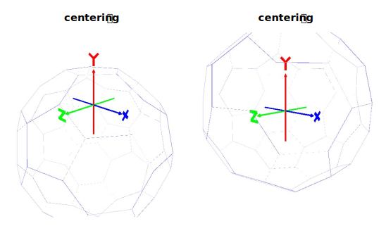

　<strong>システムコマンド：　python, dir, copy, move, ren, del</strong> 
　　コンソールから dir, copy, move, ren, del を実行できるようにした。 
　　(例) 
　　　花びらふうのメッシュを作成～セーブし、思い付きスクリプトで変形してロード。 
　　　[ 1]　LateralOuter 255 128 255　　　　　　# 花びらの外側をピンクにする 
　　　[ 2]　LateralInner 230 230 255　　　　　　# 花びらの内側をうすい青にする 
　　　[ 3]　sphere 1 30 0 180 -360/5/2 360/5/2 　# 花びらを作成 
　　　[ 4]　t 0 1 0　　　　　　　　　　　　　　   # 花びらの付け根を原点に移動 
　　　[ 5]　r 30 0 0　　　　　　　　　　　　　　# 花びらを傾ける 
　　　[ 6]　r 0 360/5 0 5　　　　　　　　　　　 # 花びらを 5 枚にする 
　　　[ 7]　s 1 1.3 1　　　　　　　　　　　　　 # 縦(y軸方向)にちょっと伸ばす 
　　　[ 8]　save flower.ply　　　　　　　　　　 # セーブ 
　　　[ 9]　d　　　　　　　　　　　　　　　　　 # 消す 
　　　[10]　python src\twist.py flower.ply 50　 # <strong>外部スクリプトで</strong>ねじる (y方向のみのお試し実装) 
　　　[11]　l flower_twisted.ply　　　　　　　　# ねじった ply をロード～表示

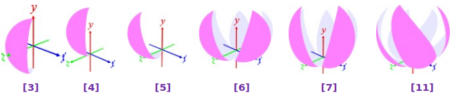

　<strong>cylinderコマンド</strong> 
　・o3d.geometry.TriangleMesh.create_cylinder で円筒形のメッシュを作成する。 
　　cylinder　(半径)　(高さ)　[(解像度 ･･･ 天板、底面の円周上の点の数)] 
 
　　manifold3d によるブール演算が、なぜか自前で作ったメッシュでは失敗するため、追加した。 
　　(例) 
　　cylinder　0.5　1　･･･　半径 0.5, 高さ 1 の円筒形を作る 
　　save　yoko.ply　　･･･　yoko.ply でセーブ  
　　d　　　　　　　　 ･･･　表示を消す 
　　cylinder　0.25　3 ･･･　半径 0.25, 高さ 3 の円筒形を作る 
　　r　90　0　0　　　 ･･･　x 軸周りに 90°回転 
　　save　tate.ply　　･･･　tate.ply でセーブ 
　　python　src\Boolean.py　yoko.ply　tate.ply　･･･　ブーリアン(引き算)を実施 

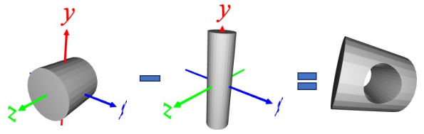

　<strong>skeleton コマンド：　fast パラメータ</strong> 
　　指の表示では今の画数(25), 太さ(0.02)がほしいが、データが大きくて処理が重いので、 
　　第二引数で fast を指定した場合、画数(5),太さ(0.001)として細くて軽量処理になるようにした。 
　　(例) 
　　　python　src\ply2skeleton.py　yoko_minus_tate.ply　･･･　ブーリアン演算結果の ply  
　　　l　yoko_minus_tate_skeleton.npy　･･･　skeleton化したデータをロード 
　　　skeleton　fast 

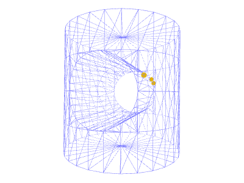

　<strong>顔, 指、全身の骨格データの取り込み</strong> 
　img2facemesh.py,　img2fingers.py,　img2skeleton.py 
　(例) 指の骨格データ取り込み 
 
　　python　src\PLY_interactive.ply 
　　python　src\img2fingers.py　images\2hands.png　･･･　画像から指の抽出 
　　l　2hands_hand_1_fingers.npy　･･･　指の骨格座標をロード 
　　skeleton　･･･　座標をパイプで接続 
　　normals　･･･　法線算出 
　　l　2hands_hand_2_fingers.npy　･･･　指の骨格座標をロード 
　　skeleton　･･･　座標をパイプで接続 
　　normals　･･･　法線算出 
　
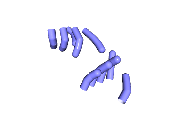 

　(例) 全身の骨格データ取り込み 
　　python　src/img2pose_keypoints　data/pose.png　･･･　全身のキーポイント抽出 
　　python　src/keypoints2parts.py　(pose_keypoints.npy)　･･･　キーポイントからパーツをメッシュ化するスクリプトを作成 
　　l　skeleton.txt　･･･　スクリプトをロード 
　　(エンターキー押下)　･･･　スクリプト実行 
　　s　1　1　1/2　･･･　z方向に出っ張っているでのz方向だけ1/2にスケーリング 
 

　(例) フェイスメッシュデータ取り込み 
　　python　src/img2facemesh.py　(画像ファイル) 

　<strong>輪郭の立体化</strong>(スケーリング＋平行移動) 
　　※ 輪郭線が細いとうまくいかない。 
　(例) 
　　l　data\section.txt　　　　　　　･･･　断面用の点データ定義スクリプトをロード 
　　(エンターキー押下)　　　　　　　･･･　スクリプト実行 
　　p　push　section　　　　　　　　･･･　Points[] から Section[] にコピー 
　　img2mesh　data\heart.png　　　　･･･　背景黒の二値(っぽい)画像から輪郭抽出 
　　(ESCキー以外を押下)　　　　　　　･･･　結果がセーブされる 
　　puccho　　　　　　　　　　　　　･･･　輪郭 (Points[]) を断面 (Section[]) で立体化 
　　surface　pclose　　　　　　　　　･･･　立体化した結果 (P2[]) をメッシュ化 
 
　　ウラ返しになる場合は、 
　　d　　　　　　　　　　　　　　　　･･･　メッシュを削除 
　　p2　reverse　p　　　　　　　　　･･･　path方向の順番を逆順にして 
　　surface　pclose　　　　　　　　　･･･　再度メッシュ化

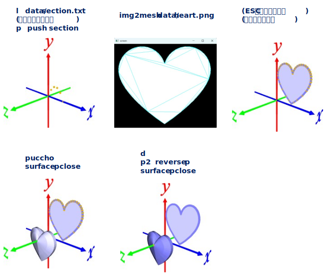

　人工物に飽きたら･･･(猫(などの自然画像)に癒される)

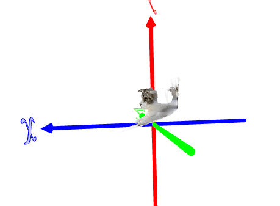

作り方 
　① <a href="https://huggingface.co/spaces/depth-anything/Depth-Anything-V2">DepthAnything V2 デモ</a> で画像から深度画像を作る

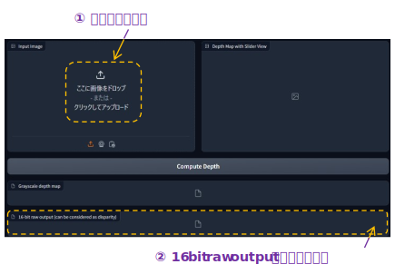

　② 画像, 深度画像 → 点群 → メッシュ

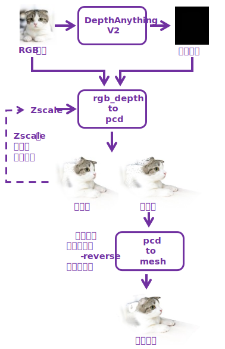
 

　<strong>cat コマンド</strong> 
　　ネコに癒されたら、次はネコの手を借りる。 
　　(実態はタートルグラフィックス) 

　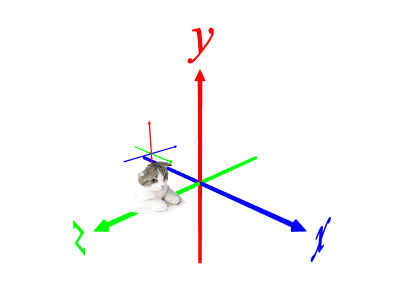

　　cat　create　(x　y　z　dx　dy　dz)：ネコを作成する 
　　※ xyz：ネコの位置,　dxdydz：ネコの向き 
　　　 (例) cat　create　1　0　0　0　0　-1 
　　　　　(1,0,0)に z 軸と反対向きのネコが生成される 

　　cat　f　(長さ)：ネコを前に進める 
　　cat　up/down/right/left/roll  (角度：degree)：ネコの向きを変える 
　　cat　c2p　：Points[] が空または 1 点の状態でネコを作成～移動した場合は, Points[]に移動軌跡をコピー 
　　　　　　　　Points[] が2点以上の状態でネコを作成～移動した場合は, P2[] に移動軌跡をコピー 
　　cat　disp　on/off：ネコ表示をする/しない 
　　　　　　　　　　　 on/off指定なしの場合はトグル 
　　cat　d　　：ネコ終了 
 
　(例) 
　　l　data\mebius1.txt 
　　(エンターキー押下) 
　　(※ ネコが止まるまで待つ) 
　　l　data\mebius2.txt 
 
　※ 
　・ねじるところが loop 処理でうまく表現できず(loop変数を参照できるようにしないと･･･)2つのスクリプトに分けた。 
　・mebius1.txt の処理が終わるのを待たないと、loop処理と後処理(mebius2.txt)の順番がぐちゃぐちゃになる。 

　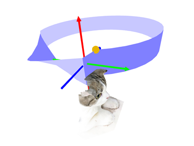

　(例) 
　　l　data/cat_spiral.txt 
　　(エンターキー押下) 
　　(complete scriptと表示されたら) 
　　cat　c2p 
　　polyline

　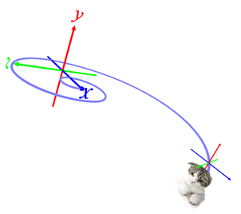

　<strong>星</strong> 
　・star　(サイズ)　(膨らみ)　[(色：rgb)] 

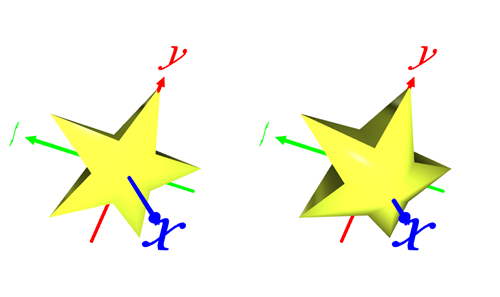

　<strong>電卓：　calc</strong> 
　　(例) calc np.sin(np.deg2rad(36))
　　コンソールから 式を入力して計算できるようにした。

</body>
</html>

